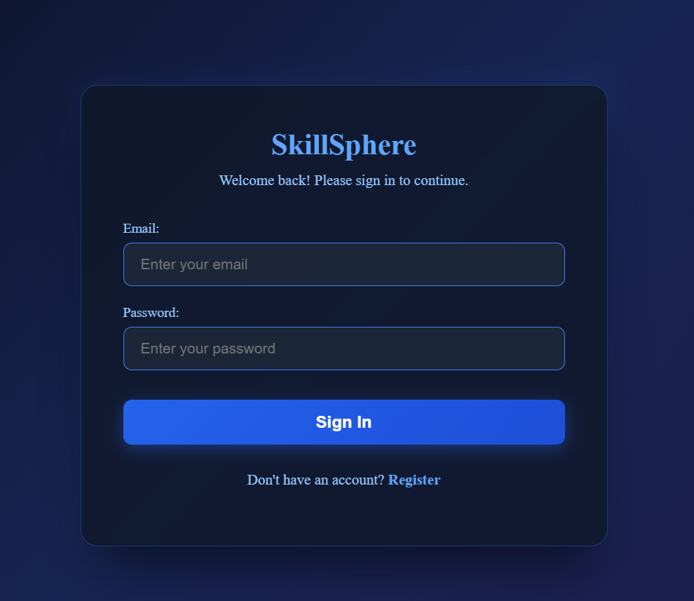
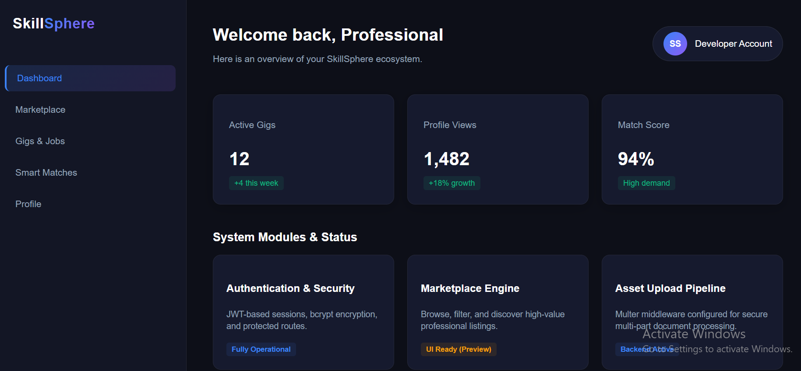
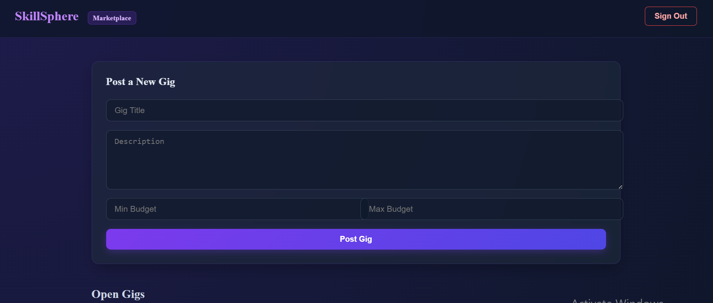

# SkillSphere – Intelligent Hyperlocal Freelance Ecosystem 🌐

> Connect clients with verified local professionals using AI-driven matching, secure milestone payments, and real-time collaboration. SkillSphere is a full-stack MERN platform connecting clients with local freelancers through AI-powered job matching, secure milestone payments, real-time collaboration, and comprehensive admin analytics.

---

## 📸 Application Previews

| Login Screen | Dashboard | Marketplace |
| :---: | :---: | :---: |
|  |  |  |

---

## 📂 Project Architecture

```text
skillsphere/
├── client/                      # Frontend React application
│   ├── public/                  # Static assets and index.html
│   └── src/                     # React components, pages, and styles
└── server/                      # Backend Node.js/Express application
    ├── config/                  # Database & passport configurations
    ├── controllers/             # Business logic (auth, gig, match, profile)
    ├── middleware/              # Security, auth, and file upload handlers
    ├── models/                  # MongoDB schemas (User, Gig, Job, Profile)
    ├── routes/                  # API routing endpoints
    ├── services/                # AI matching services
    └── utils/                   # Email helpers and utilities
```    
## 🚀 Core Features At-A-Glance
🔐 Multi-Role Auth: Secure role-based access control (Client, Freelancer, Admin) featuring JWT, Google OAuth, and 2FA.

🤖 AI Job Matching: Powered by Huggingface AI for smart gig recommendations, skill similarity scoring, and trend detection.

👤 Professional Profiles: Rich portfolios, resume uploads, proficiency levels, availability calendars, and badges.

💼 Gig Marketplace & Bidding: Budget-defined projects, milestones, structured proposals, and negotiation workflows.

💬 Real-Time Collaboration: Instant messaging, file sharing, typing indicators, read receipts, and video via Socket.IO.

💳 Secure Escrow Payments: Stripe/Razorpay integration supporting milestone releases, automated payouts, and refunds.

🛡️ Admin & Reputation Control: Weighted reviews, fraud detection, user moderation, and comprehensive revenue insights.

## 🛠️ Installation & Getting Started1. 
1. Clone & Setup RepositoryBashgit clone [https://github.com/aadyadixit17-code/skillsphere.git](https://github.com/aadyadixit17-code/skillsphere.git)
cd skillsphere

2. Configure Environment VariablesCreate a .env file inside the server/ directory and populate your database URI, JWT secret, and API keys.

3. Run the ApplicationStart Backend Server:Bashcd server

npm install
npm start
Start Frontend Client:Bashcd ../client

npm install
npm run dev
